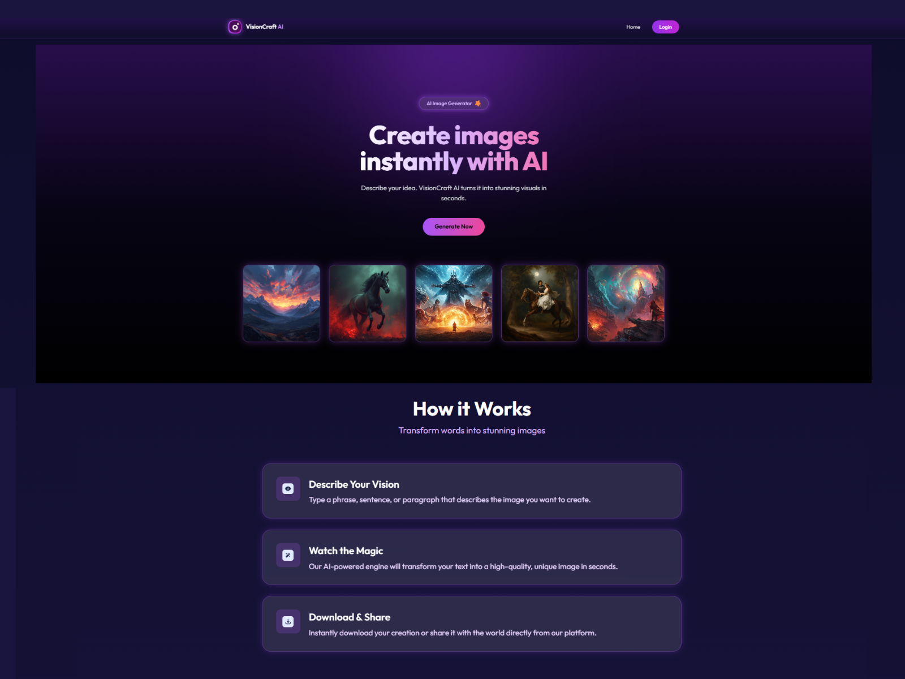
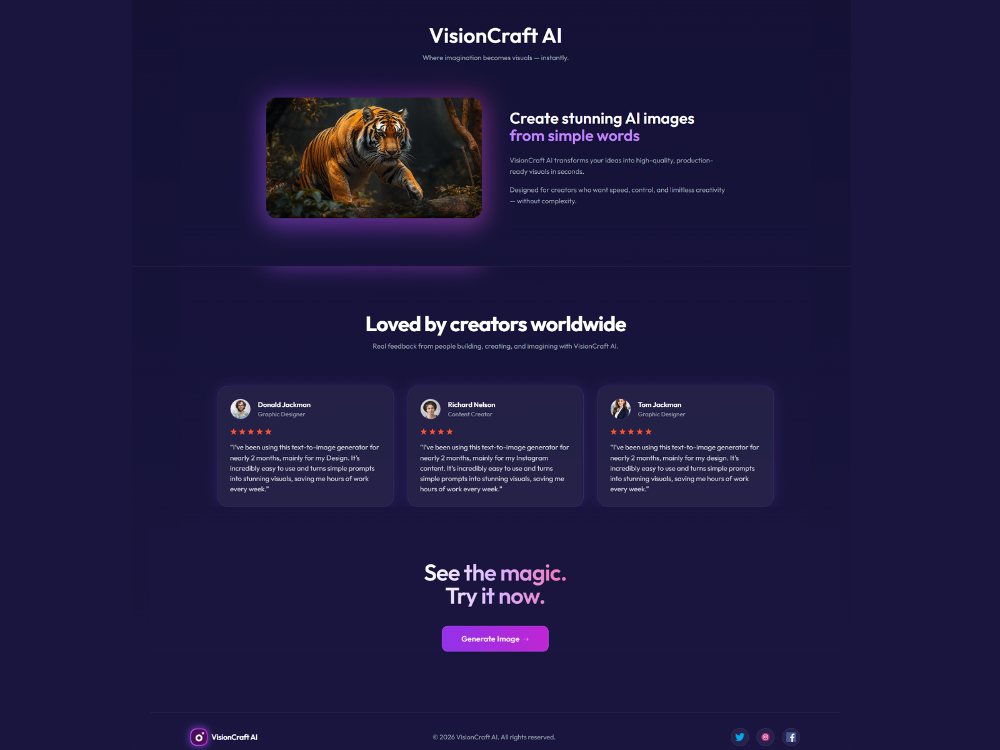
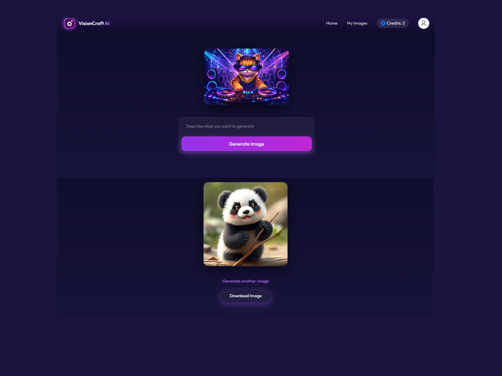
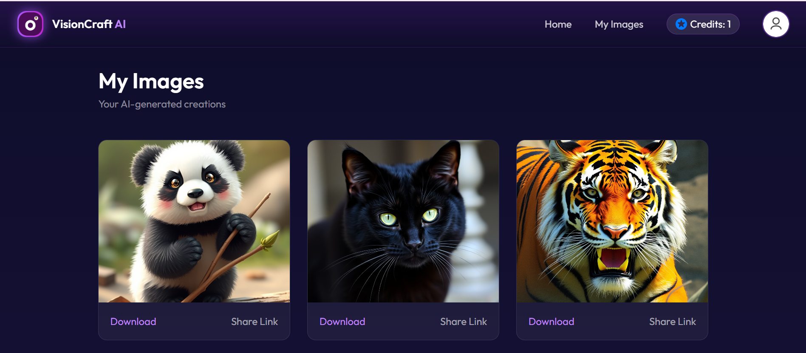
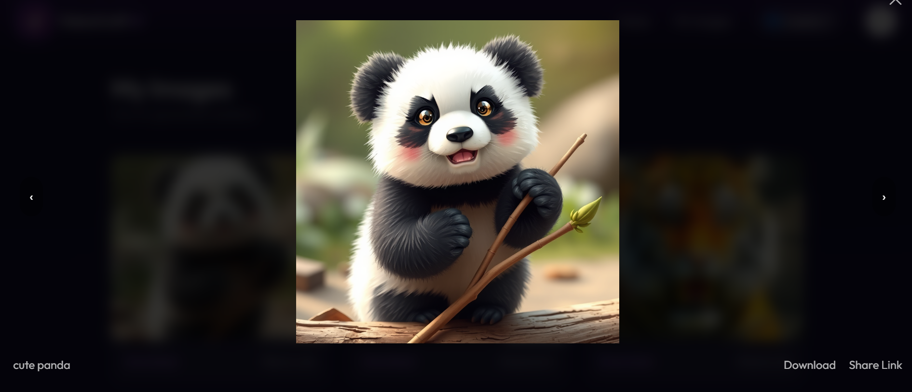

# VisionCraft AI 🎨

VisionCraft AI is a full-stack AI image generation platform that allows users to generate images using AI, manage daily credits, and share images publicly with secure access controls.

The platform is designed with a clean UI, credit-based usage system, and secure backend APIs.

---

## 🚀 Tech Stack

### Frontend
- React
- Tailwind CSS
- Context API

### Backend
- Node.js
- Express.js
- MongoDB (Mongoose)
- Cloudinary (image storage)

---

## ✨ Key Features

- **AI Image Generation**  
  Generate high-quality AI images using text prompts.

- **Daily Credit Reset System**  
  Users receive daily credits automatically, ensuring fair usage of AI resources.

- **Image Gallery with Full-Screen Preview**  
  Browse generated images in a gallery with full-screen preview support.

- **Public Shareable Links**  
  Share images publicly without requiring user login.

- **Secure Image Downloads**  
  Image downloads are protected and require authenticated access.

---

## 🔐 Authentication & Security
- JWT-based authentication
- Protected API routes for sensitive operations
- Secure handling of environment variables using `.env`

---

## 📁 Project Structure

VisionCraft-AI/
├── client/ # React frontend
├── server/ # Node.js backend
├── .gitignore
├── README.md

---

## ⚙️ Setup Instructions

### 1️⃣ Clone the Repository

git clone <your-repo-url>
cd VisionCraft-AI

### 2️⃣ Environment Variables Setup
Create .env files in both client and server directories using .env.example as reference.

Example (server .env):

MONGO_URI=your_mongodb_uri
JWT_SECRET=your_jwt_secret
CLOUDINARY_NAME=your_cloudinary_name
CLOUDINARY_API_KEY=your_api_key
CLOUDINARY_API_SECRET=your_api_secret
BACKEND_URL=your backend_url

### 3️⃣ Install Dependencies
Frontend:

cd client
npm install

Backend:

cd server
npm install

### 4️⃣ Run the Application
Start Backend Server:
cd server
npm run dev

Start Frontend:
cd client
npm run dev

📌 Notes

Ensure MongoDB is running locally or connected via MongoDB Atlas.

Cloudinary credentials are required for image uploads.

.env files are intentionally excluded from version control for security.

### 🔮Future Enhancements

-Forgot / Reset password via email
-User profile management
-Payment-based credit system

---

## 🖼️ Screenshots

### Home 

  
  

### & AI Generation

  

### Gallery & Full-Screen Preview

  
  

🧑‍💻 Author

Built by Tuhina
