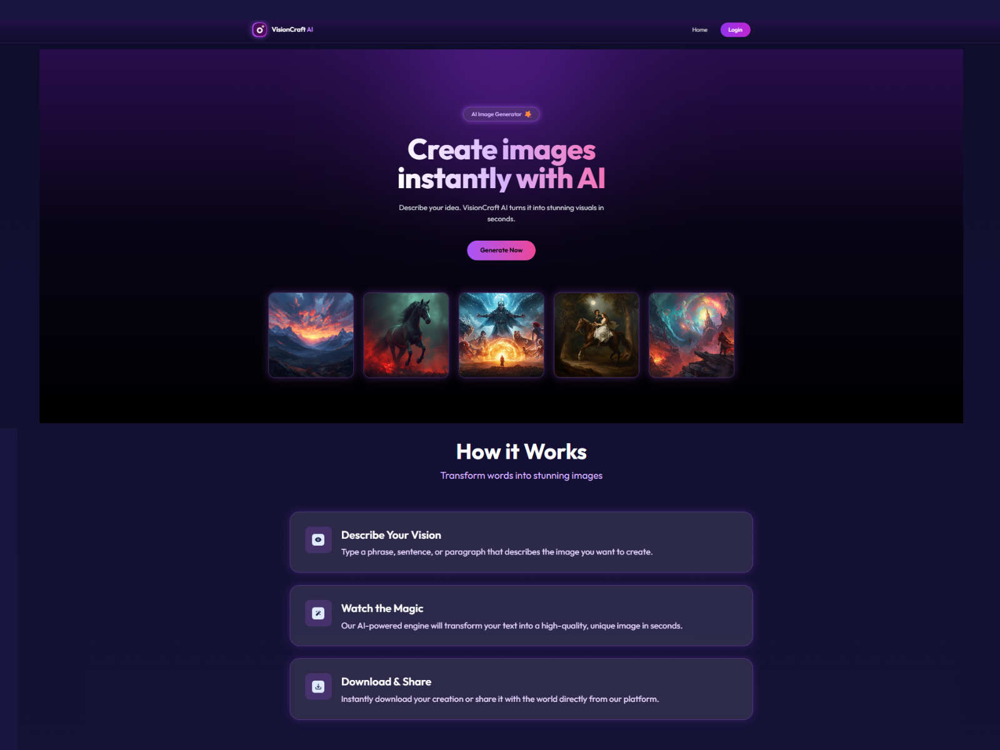
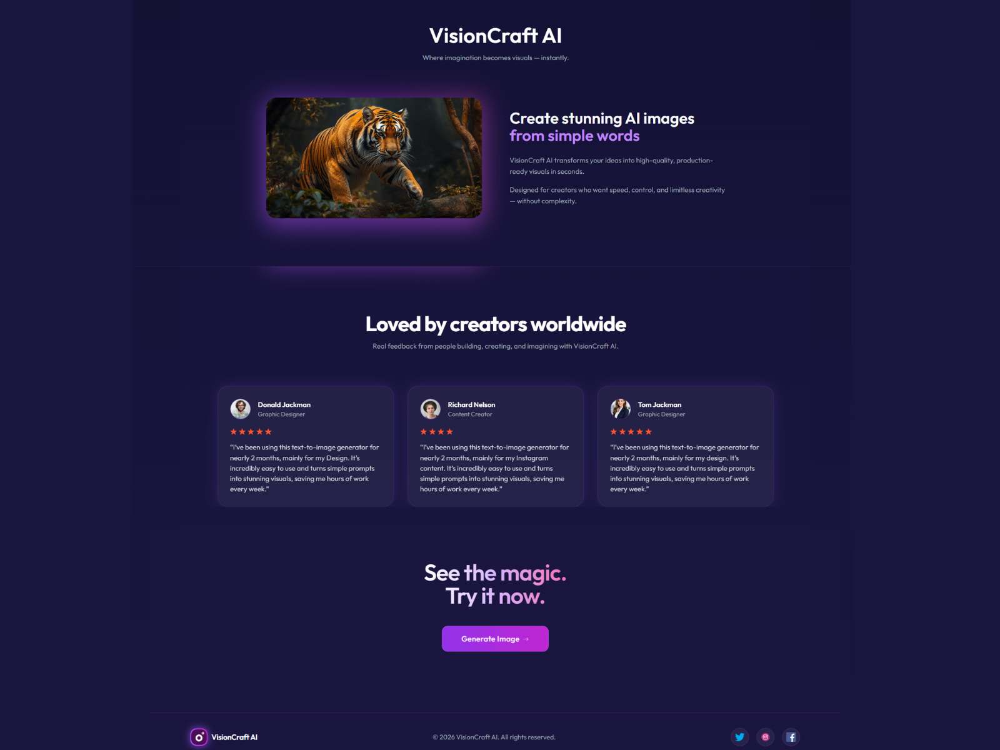
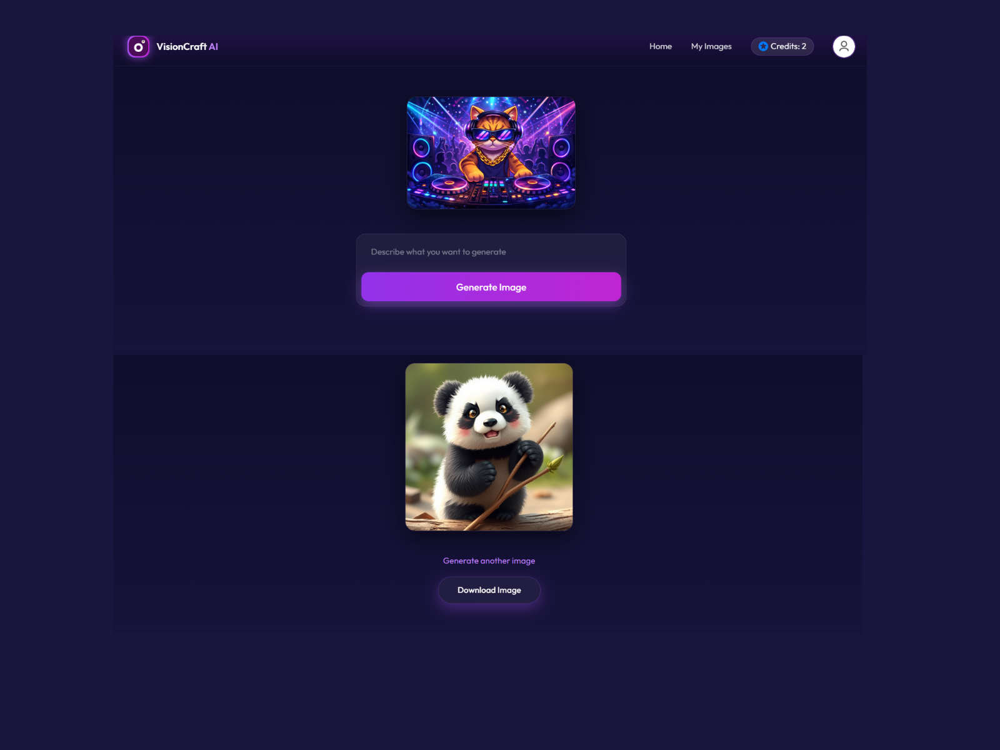
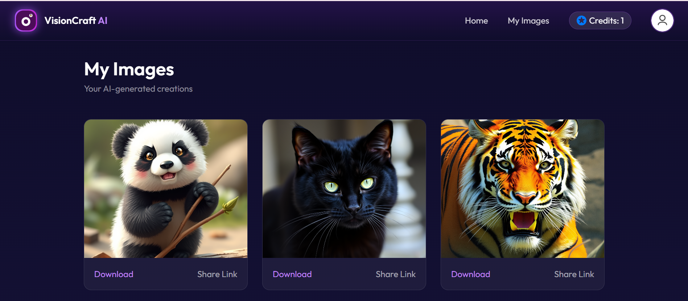
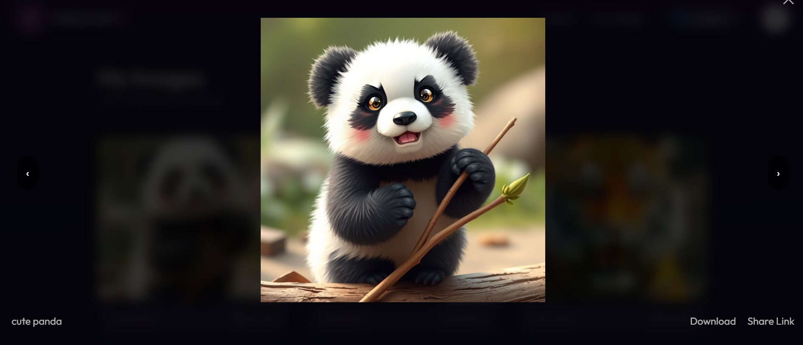

# VisionCraft AI — Full Stack AI Image Generation Platform

VisionCraft AI is a modern full-stack AI image generation platform built with the MERN stack. Users can generate AI-powered images from text prompts, manage their creations in a personal gallery, download images, and share them through public links.

The project focuses on building a real-world production-like application with authentication, secure backend APIs, cloud storage, responsive UI, and a clean user experience.

---

## 🌐 Live Demo

**Frontend:** https://your-vercel-link.vercel.app

**Backend:** https://your-render-link.onrender.com

---

## ✨ Features

### 🎨 AI Image Generation
Generate high-quality AI images from natural language prompts.

### 🔐 Secure Authentication
- JWT Authentication
- Protected Routes
- Secure API Access

### 🖼 Personal Gallery
- View all generated images
- Full-screen image preview
- Image navigation
- Responsive gallery layout

### 📥 Image Download
Download generated images directly to your device.

### 🔗 Public Image Sharing
Generate public share links that can be viewed without logging in.

### 💳 Daily Credit System
- Daily free credits
- Automatic credit reset
- Usage limitation for fair access

### 📱 Responsive Design
Optimized for desktop, tablet, and mobile devices.

### ✨ Modern UI
- Dark minimal design
- Smooth Framer Motion animations
- Interactive user experience

---

# 🛠 Tech Stack

## Frontend

- React.js
- Tailwind CSS
- Context API
- React Router DOM
- Axios
- Framer Motion

## Backend

- Node.js
- Express.js
- MongoDB Atlas
- Mongoose
- JWT Authentication
- Cloudinary

## AI Integration

- ClipDrop API

---

# 📂 Project Structure

```
VisionCraft-AI
│
├── client
│   ├── assets
│   ├── components
│   ├── context
│   ├── pages
│   └── App.jsx
│
├── server
│   ├── config
│   ├── controllers
│   ├── middleware
│   ├── models
│   ├── routes
│   └── server.js
│
└── README.md
```

---

# 🔥 Application Workflow

```
User

↓

React Frontend

↓

Express REST API

↓

MongoDB Database

↓

Cloudinary Storage

↓

Generated Image
```

---

# 🔑 Environment Variables

Create a `.env` file inside the **server** folder.

```env
MONGO_URI=

JWT_SECRET=

CLIPDROP_API=

CLOUDINARY_NAME=

CLOUDINARY_API_KEY=

CLOUDINARY_API_SECRET=

BACKEND_URL=
```

---

# ⚙ Installation

Clone the repository

```bash
git clone https://github.com/Tuhina-Paria/VisionCraft-AI.git
```

Move into the project

```bash
cd VisionCraft-AI
```

Install frontend dependencies

```bash
cd client
npm install
```

Install backend dependencies

```bash
cd ../server
npm install
```

Start backend

```bash
npm run dev
```

Start frontend

```bash
cd ../client
npm run dev
```

---


# 📸 Screenshots

## Home Page

<p align="center">


</p>

---

## AI Image Generation

<p align="center">

</p>

---

## Personal Gallery

<p align="center">


</p>

---

# 🎯 Why I Built This

I built VisionCraft AI to strengthen my full-stack development skills by combining frontend development, backend APIs, authentication, cloud storage, database management, and AI integration into one complete project.

The goal was to create a production-like application that demonstrates real-world development practices rather than a simple tutorial project.

---

# 🚀 Future Improvements

- Email Verification
- Forgot Password
- Password Reset
- Payment Integration
- Image Collections
- Prompt History
- AI Image Editing
- Image Search
- AI Upscaling

---

# 👩‍💻 Author

**Tuhina Paria**

Full Stack Developer

GitHub: https://github.com/Tuhina-Paria

LinkedIn: https://linkedin.com/in/yourlinkedin


---

## ⭐ If you found this project useful, consider giving it a star!
